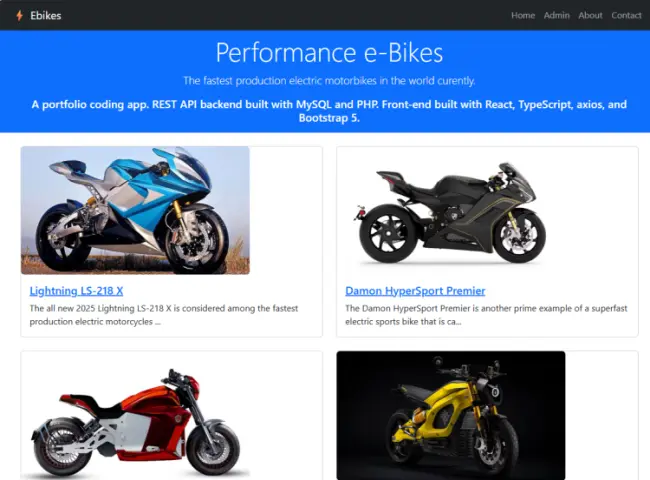

# ebikesapp  |  🏍️   EV Sport MotorBikes App
A blog on the fastest production elecrtric motorbikes in the world currently.  Built as a front-end portfolio coding project, using React, Typescript, axios, Bootstrap version 5 CSS framework, Bootstrap Icons, and consumes a PHP and MySQL based REST API backend. (The backend project can be found here ). Enjoy!

https://ebikesapp.ryanhunter.ca/images/screens/screens_01_ebikesapp.webp

## 📸 Preview
Live **Site Demo** ~ [The Fastest Electric Sports MotorBikes](https://ebikesapp.ryanhunter.ca/)  🏍️ 

 


React and TypeScript based front-end app showing the world's fastest production motorcycles currently. Pulls data from a PHP and MySQL based REST API backend also hosted in this GitHub as 'ebikesAPI'. Enjoy!


 

## 🔧 Built With

- React 18 + TypeScript
- Bootstrap 5
- Axios
- React Router DOM
- FontAwesome icons
- Bootstrap icons
- Google Fonts


## 🚀 Getting Started (Dev)

- git clone https://github.com/systemsvanguard/ebikesapp.git ~ (ebikes App)    
- cd ebikesapp
- npm install
- npm start 
- Runs on port 3000 ---> http://localhost:3000/   
- Please also see the related & prerequisite project, the backend REST API, located at  https://github.com/systemsvanguard/ebikesapi.git  ~ (ebikes API)     


## Steps to Install 
- Run the command below from the command line / terminal / command prompt.
- git clone https://github.com/systemsvanguard/standandspeak.git  
- cd standandspeak
- ensure your have Node & NPM pre-installed. Run commands 'node --version && npm -v'.
- npm install.  (This ensures all dependencies are installed).
- npm run dev 
- Runs on port 3000 ---> http://localhost:3000/  
- Change the web port as needed.


## License
This project is licensed under the terms of the **MIT** license.


## Screenshots 

   

   

   

   

   

  

   

    


# React + TypeScript + Vite

This template provides a minimal setup to get React working in Vite with HMR and some ESLint rules.

Currently, two official plugins are available:

- [@vitejs/plugin-react](https://github.com/vitejs/vite-plugin-react/blob/main/packages/plugin-react) uses [Babel](https://babeljs.io/) for Fast Refresh
- [@vitejs/plugin-react-swc](https://github.com/vitejs/vite-plugin-react/blob/main/packages/plugin-react-swc) uses [SWC](https://swc.rs/) for Fast Refresh

## Expanding the ESLint configuration

If you are developing a production application, we recommend updating the configuration to enable type-aware lint rules:

```js
export default tseslint.config({
  extends: [
    // Remove ...tseslint.configs.recommended and replace with this
    ...tseslint.configs.recommendedTypeChecked,
    // Alternatively, use this for stricter rules
    ...tseslint.configs.strictTypeChecked,
    // Optionally, add this for stylistic rules
    ...tseslint.configs.stylisticTypeChecked,
  ],
  languageOptions: {
    // other options...
    parserOptions: {
      project: ['./tsconfig.node.json', './tsconfig.app.json'],
      tsconfigRootDir: import.meta.dirname,
    },
  },
})
```

You can also install [eslint-plugin-react-x](https://github.com/Rel1cx/eslint-react/tree/main/packages/plugins/eslint-plugin-react-x) and [eslint-plugin-react-dom](https://github.com/Rel1cx/eslint-react/tree/main/packages/plugins/eslint-plugin-react-dom) for React-specific lint rules:

```js
// eslint.config.js
import reactX from 'eslint-plugin-react-x'
import reactDom from 'eslint-plugin-react-dom'

export default tseslint.config({
  plugins: {
    // Add the react-x and react-dom plugins
    'react-x': reactX,
    'react-dom': reactDom,
  },
  rules: {
    // other rules...
    // Enable its recommended typescript rules
    ...reactX.configs['recommended-typescript'].rules,
    ...reactDom.configs.recommended.rules,
  },
})
```
